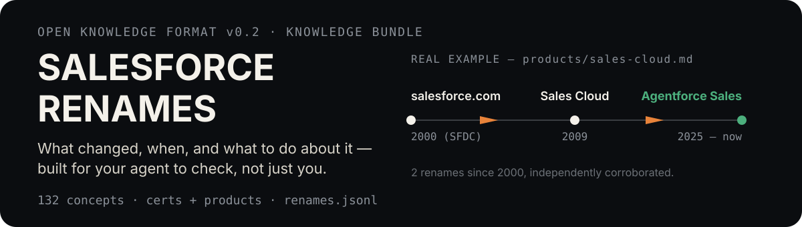
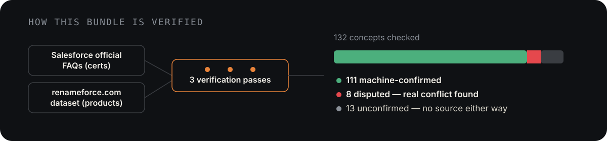

<p align="center">
  
</p>

## Give this to your agent

> Clone `github.com/shivanshsen7/salesforce-renames`, check it against my
> Salesforce certs/products, tell me what's changing and by when.

No GitHub auth needed — public repo, plain `git clone`. No shell access?
Pull `renames.jsonl` straight off the GitHub API or raw content URL and
`jq`/`grep` it instead:

```sh
# All entries mentioning "Sales Cloud" anywhere
curl -s https://raw.githubusercontent.com/shivanshsen7/salesforce-renames/main/renames.jsonl \
  | grep -i "sales cloud"

# Just the certs retiring, as a table of name + deadline
curl -s https://raw.githubusercontent.com/shivanshsen7/salesforce-renames/main/renames.jsonl \
  | jq -c 'select(.["@type"]=="RetiringCertification") | {certName, retirementDate}'
```

## Why trust it

<p align="center">
  
</p>

This isn't one dataset taken at face value. `certs/` comes straight from
Salesforce's own official FAQs. `products/` comes from the
[renameforce.com](https://renameforce.com) community dataset — cited as a
source, not silently absorbed as primary fact. Three verification passes
followed, each stricter than the last:

- **Pass 1** (7 agents, one per product category plus one for all 40 certs):
  went looking for any second source per entry.
- **Pass 2**: re-checked everything pass 1 left unresolved, restricted to
  official Salesforce sources only — never renameforce.com or a general
  blog.
- **Pass 3**: audited source *quality*, not just presence, since it turned
  out every certification's "second source" was a blog aggregator despite
  the primary source already being official. All 40 certs got re-checked by
  fetching Salesforce's two canonical FAQ pages live (zero drift found —
  every name and date matched exactly); 42 products got re-researched in
  category-grouped batches against official domains only. This pass also
  caught a subagent citing renameforce.com as its own "confirmation" —
  circular, not independent — and reverted it.

**Net result**:

- **All 40 certifications** are directly re-confirmed against Salesforce's
  live official pages.
- **71 of 92 products** are machine-confirmed against official-domain
  sources — a step up from community-sourced, though still short of a
  human review.
- **8 products are flagged as actively disputed** — a real, sourced
  conflict, not just an absent second source. The sharpest one: Winter 2026
  release notes still call two products "Service Cloud" and "Field
  Service," but this bundle's own live-fetched certification data explicitly
  renames the matching certs to "Agentforce Service Consultant" and
  "Agentforce Field Service and Operations Consultant" — two official
  Salesforce pages that disagree with each other.
- **13 products remain genuinely unconfirmed** — no official source found
  either way.
- Several real errors were caught and corrected along the way — Audience
  Studio's and Salesforce Functions' actual retirement dates, Nonprofit
  Cloud's actual current name, an internal date-overlap bug in Code
  Analyzer, and a product-history chain (CRM Analytics) that had 4 of 9
  claimed name stages cut because no source anywhere could confirm them.

See `log.md`'s three dated verification entries for the exact reasoning and
sources behind every one of these.

## How to navigate this repo

| You want... | Go to |
|---|---|
| Raw data to `grep`/`jq` — no cloning, no markdown parsing | [`renames.jsonl`](renames.jsonl) |
| To browse certifications retiring Feb 2027 | [`certs/retiring/`](certs/retiring/) (24, each its own file) |
| To browse certifications with a cosmetic name change | [`certs/renamed/`](certs/renamed/) (16) |
| To browse product/platform rename history since 2000 | [`products/`](products/) (92) |
| The strict [Open Knowledge Format](https://github.com/GoogleCloudPlatform/knowledge-catalog/blob/main/okf/SPEC.md) v0.2 entry point | [`index.md`](index.md) |
| The dated history of what changed in this bundle | [`log.md`](log.md) |

Each subdirectory has its own `index.md` — GitHub renders it automatically
when you click into the folder, so `products/` already gives you a full
table of contents without this README repeating all 92 names.

## Structure

```
index.md            OKF-spec entry point (progressive disclosure, no frontmatter)
log.md               dated update history
renames.jsonl        all 132 concepts, one JSON-LD node per line
certs/retiring/       24 concepts — certifications retiring 2027-02-01
certs/renamed/        16 concepts — certifications with a cosmetic name change 2026-07-24
products/             92 concepts — product/platform rename history, 2000–present
```

Every concept is a plain markdown file: YAML frontmatter (only `type` is
required by spec) plus a normal markdown body. `sources`, `generated`, and
`verified` are what make the trust story above queryable rather than just
asserted in this paragraph — open any file in `products/` or `certs/` to
see them directly.

## Correcting or extending this

Spot an error, or know about a rename this bundle is missing? Open an issue
or a PR. A human review pass will upgrade entries from `machine-confirmed`
to `verified: {by: human:..., at: ...}` as it happens.
